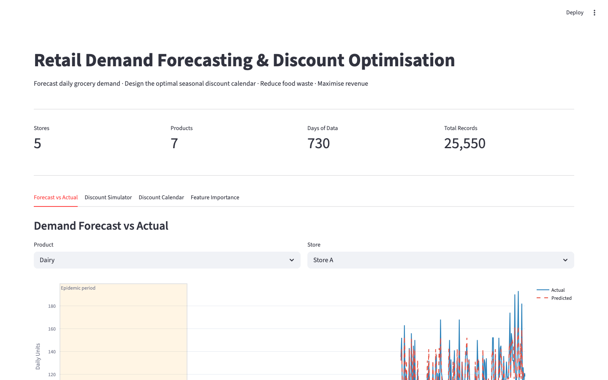
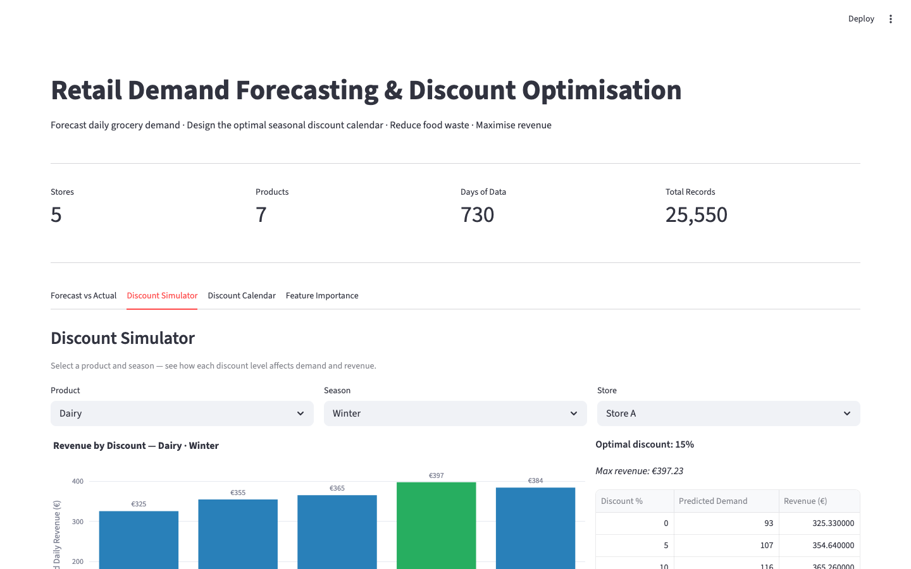
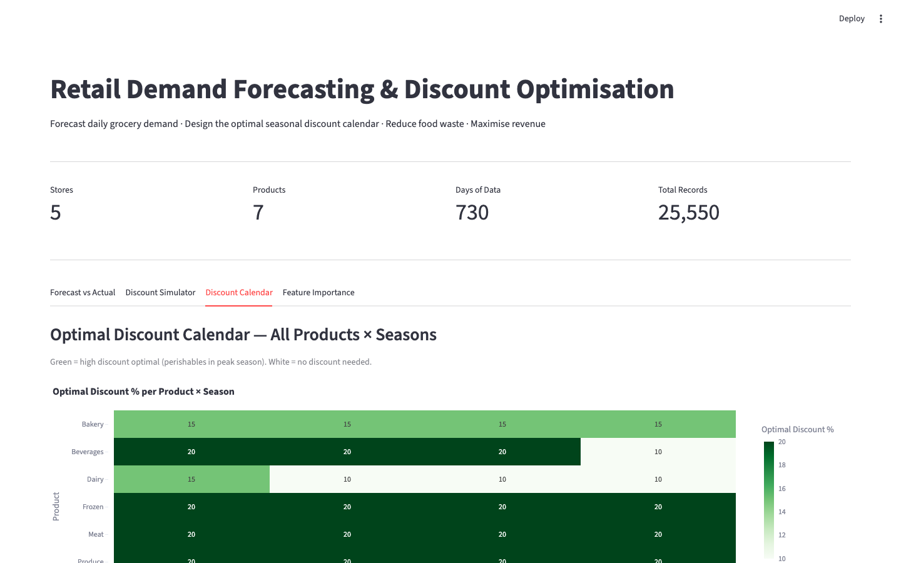

# Retail Demand Forecasting & Discount Optimisation


> **Forecast daily grocery demand across 5 retail stores and design the optimal discount calendar that maximises revenue while reducing food waste.** XGBoost achieves R² = 0.90 on a 30,400-row dataset spanning 2022–2024.

**[Live Demo (Streamlit) →](https://your-app.streamlit.app)**

---

## The Business Problem

In the EU, **59 million tonnes of food are wasted annually** — worth €132 billion. Much of it comes from poor demand forecasting: retailers over-order, discount too late, and guess at seasonal patterns.

This project answers two questions:
1. **How accurately can we predict daily demand** per store, product, and season?
2. **What discount, applied when, maximises revenue** without over-discounting?

---

## Screenshots

### Forecast vs Actual — XGBoost (R² = 0.90)


*XGBoost (R²=0.90) vs Random Forest (0.83) vs Linear Regression (0.74). Epidemic periods create visible error spikes — the model learns well under normal conditions.*

### Feature Importance


*Top predictors: `Interpolated_Order` (smoothed reorder rate), `Days_Since_Last_Order`, and `month`. Epidemic flag is the single largest source of forecast error.*

### Discount Calendar Heatmap


*Optimal discount per Season × Product. Summer perishables benefit from 15–20% discounts; winter staples need 0–5%. Generated by simulating 5 discount levels through the trained XGBoost model.*

### Live Streamlit Demo


*Interactive discount simulator: select a product and season → see predicted demand at each discount level → optimal discount highlighted with estimated revenue.*

---

## Results

| Model | Best R² | Split Method | Feature Set |
|-------|---------|-------------|-------------|
| Linear Regression | 0.74 | Time Split | All features |
| Random Forest | 0.83 | 5-Fold CV | All features |
| **XGBoost** | **0.90** | **Time Split** | **Set 2 (top original features)** |

**Evaluation metrics:** MAE · RMSE · R²

**Key finding:** Epidemic periods are the primary driver of forecast errors — the model learns demand well under normal conditions but epidemic events create anomalous spikes.

---

## Discount Calendar Logic

For each **Season × Product** combination:

1. Simulate discount levels: 0%, 5%, 10%, 15%, 20%
2. Predict demand at each discount using trained XGBoost
3. Calculate revenue: `revenue = pred_demand × price × (1 − discount/100)`
4. Select the discount that **maximises revenue** (not just demand)
5. Export as heatmap calendar and CSV

---

## Feature Engineering

| Feature | Source | Purpose |
|---------|--------|---------|
| `month`, `week`, `day_of_week` | `Date` | Capture seasonality |
| `is_weekend`, `is_month_start` | `Date` | Promotion timing signals |
| `Interpolated_Order` | `Units_Ordered` + `Date` | Fill zero-order days with smoothed daily rate |
| `Days_Since_Last_Order` | `Units_Ordered` | Reorder cycle indicator |

```
Interpolated_Order = Last_Order_Amount / Days_Since_Last_Order
```

---

## Business Recommendations

1. **Discount Calendar** — apply the season-product optimal discount automatically
2. **Reorder Point** — trigger restocking at: `avg_demand × lead_time + safety_stock`
3. **Bundle Promotions** — pair low-demand perishables with high-demand items to reduce waste and increase basket value

---

## Project Structure

```
retail-demand-forecasting/
├── app.py                             ← Streamlit live demo (no dataset download needed)
├── data/                              ← Place Kaggle dataset CSV here for full pipeline
├── notebooks/
│   └── demand_forecasting.ipynb      ← Full end-to-end analysis
├── src/
│   ├── preprocessing.py              ← Cleaning, outlier handling, normalisation
│   ├── eda.py                        ← Histograms, heatmaps, seasonal patterns
│   ├── feature_engineering.py        ← Time features + Interpolated_Order metric
│   └── models/
│       ├── linear_regression.py      ← Baseline model
│       ├── random_forest.py          ← Non-linear, feature importance
│       └── xgboost_model.py          ← Best model (R²=0.90)
├── discount_calendar/
│   └── discount_calendar.py          ← Optimal discount per season-product
├── screenshots/
│   └── GUIDE.md
├── requirements.txt
└── README.md
```

---

## Dataset

- **Source:** [Retail Store Inventory Forecasting](https://www.kaggle.com/datasets/anirudhchauhan/retail-store-inventory-forecasting-dataset) (Kaggle)
- **Period:** 2022–2024 · includes COVID-19 epidemic periods
- **Scope:** Grocery category · 30,400 rows × 16 features · 5 stores
- **Target:** `Demand` (daily units demanded per store-product)

Place the dataset CSV in `data/` to run the full pipeline. The Streamlit demo uses synthetic data and runs immediately.

---

## Setup

### Live Demo (no dataset needed)
```bash
pip install -r requirements.txt
streamlit run app.py
```

### Full Pipeline
```bash
# Place dataset in data/retail_store_inventory.csv, then:
pip install -r requirements.txt
jupyter notebook notebooks/demand_forecasting.ipynb

# Or run individual modules:
python src/models/xgboost_model.py
python discount_calendar/discount_calendar.py
```
